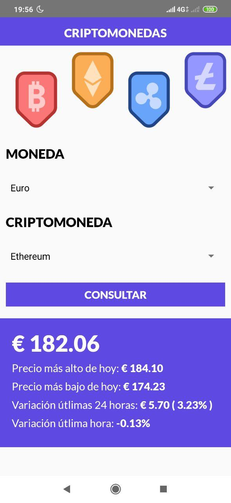
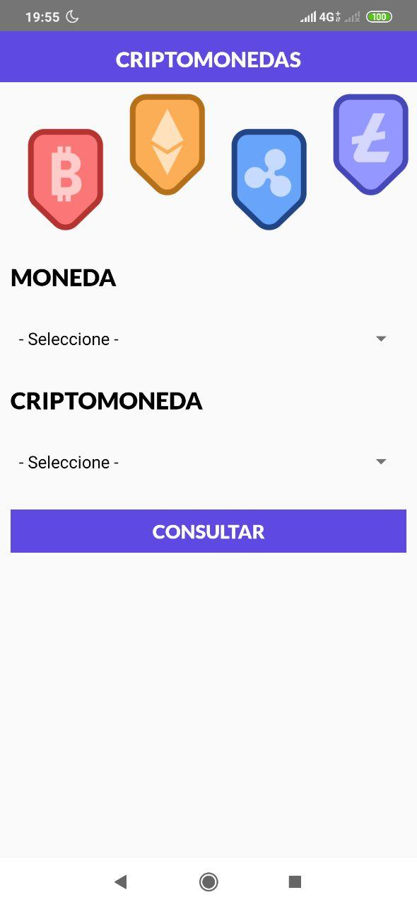
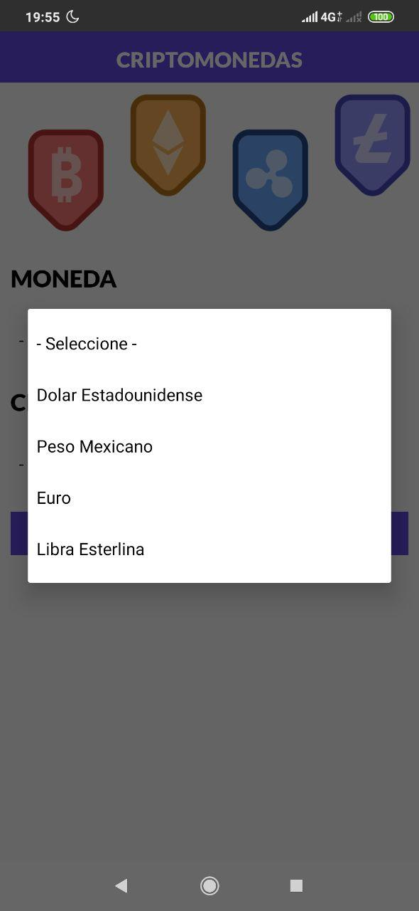
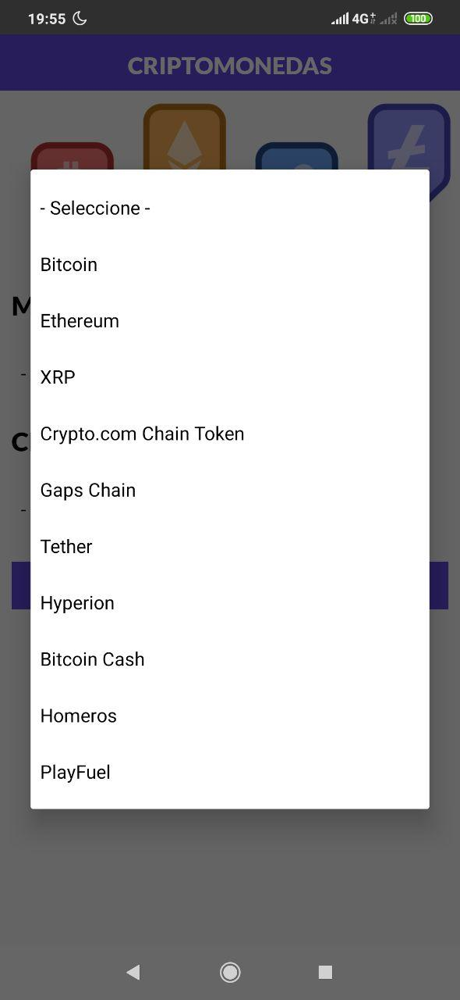

# Ejemplo básico de conexión a una API mediante AXIOS con React Native

Simple aplicación para consultar los precios de las Top 10 criptomonedas.
Los datos se extraen de https://cryptocompare.com

### Screens

